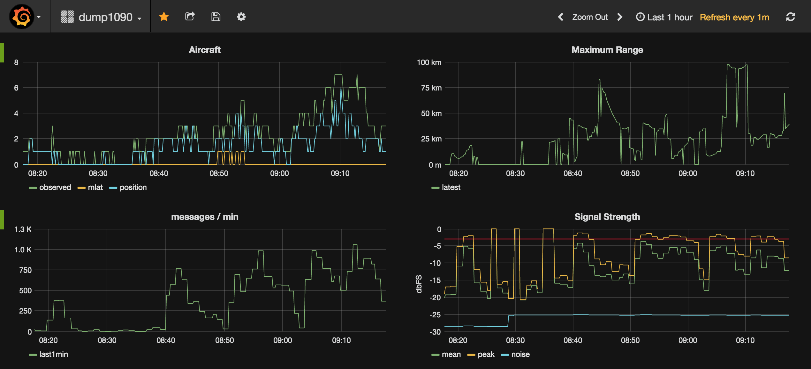

dump1090 Exporter
=================

`Dump1090 <https://github.com/MalcolmRobb/dump1090>`_ is a simple Mode S decoder
for RTLSDR devices that is commonly used for tracking aircraft. Dump1090 makes
a number of operating metrics available to track the performance of the tool
and its environment.

The dump1090exporter collects statistics from dump1090 and exposes it to the
`Prometheus <https://prometheus.io/>`_ monitoring server for aggregation and
later visualisation (e.g. using `Grafana <https://grafana.net/dashboards/768>`_).

Install
-------

The dump1090 exporter is written using Python 3 and will not work with
Python 2. The dump1090 exporter is installed using the Python package manager
*pip*. The *pip3* alias typically links to the Python3 package manager so
the install would look like this:

.. code-block:: console

    pip3 install dump1090exporter

If you are installing this package within a Python3 virtual environment then
use:

.. code-block:: console

    pip install dump1090exporter

The dump1090exporter is also available as a Docker container. See the *Docker*
section below for more details.

Run
---

Once installed the dump1090 exporter can be easily run from the command
line as the installation script includes a console entry point.

The dump1090 exporter accepts a number of command line arguments. These
can be found by using the standard command line help request.

.. code-block:: console

    $ dump1090exporter -h

Below is an example usage.

.. code-block:: console

    $ dump1090exporter \
      --url=http://192.168.1.201:8080 \
      --port=9105 \
      --latitude=-34.9285 \
      --longitude=138.6007 \
      --debug

In the example above the exporter is instructed to monitor a dump1090
instance running on a machine with the IP address 192.168.1.201 using
the default port (8080) used by dump1090 tool. The exporter exposes a
service for Prometheus to scrape on port 9105 by default but this can
be changed by specifying it with the *--port* argument.

The example above also instructs the exporter to use a specific receiver
origin (lat, lon). In this case it is for Adelaide, Australia. In most
cases the dump1090 tool is not configured with the receivers position.
By providing the exporter with the receiver location it can calculate
ranges to aircraft. If the receiver position is already set within the
dump1090 tool (and accessible from the *data/receivers.json* resource)
then the exporter will use that data as the origin.

The exporter fetches aircraft data (from *data/aircraft.json*) every 10
seconds. This can be modified by specifying a new value with the
*--aircraft-interval* argument.

The exporter fetches statistics data (from *data/stats.json*) every 60
seconds, as the primary metrics being exported are extracted from the
*last1min* time period. This too can be modified by specifying a new
value with the *--stats-interval* argument.

The metrics that the dump1090 exporter provides to Prometheus can be
accessed for debug and viewing using curl or a browser by fetching from
the metrics route url. For example:

.. code-block:: console

    $ curl -s http://0.0.0.0:9105/metrics | grep -v "#"
    dump1090_aircraft_recent_max_range{time_period="latest"} 1959.0337385807418
    dump1090_messages_total{time_period="latest"} 90741
    dump1090_recent_aircraft_observed{time_period="latest"} 4
    dump1090_recent_aircraft_with_multilateration{time_period="latest"} 0
    dump1090_recent_aircraft_with_position{time_period="latest"} 1
    dump1090_stats_cpr_airborne{time_period="last1min"} 176
    dump1090_stats_cpr_airborne{time_period="total"} 18293
    ...

The metrics exposed by the dump1090-exporter are all prefixed with the
*dump1090_* string so as to provide a helpful namespacing which makes them
easier to find in visualisation tools such as Grafana.

The exporter exposes generalised metrics for statistics and uses the multi
dimensional label capability of Prometheus metrics to include information
about which group the metric is part of.

To extract information for the peak signal metric that dump1090 aggregated
over the last 1 minute you would specify the time_period for that group:

.. code-block:: console

    dump1090_stats_local_peak_signal{job="dump1090", time_period="last1min"}

In the stats.json data there are 5 top level keys that contain statistics for
a different time period, defined by the "start" and "end" subkeys. The top
level keys are:

- *latest* which covers the time between the end of the "last1min" period and
  the current time. In my dump1090 setup this is always empty.
- *last1min* which covers a recent 1-minute period. This may be up to 1 minute
  out of date (i.e. "end" may be up to 1 minute old)
- *last5min* which covers a recent 5-minute period. As above, this may be up
  to 1 minute out of date.
- *last15min* which covers a recent 15-minute period. As above, this may be up
  to 1 minute out of date.
- *total* which covers the entire period from when dump1090 was started up to
  the current time.

By default only the *last1min* time period is exported as Prometheus can be
used for accessing historical data.

Prometheus Configuration
------------------------

Prometheus needs to be told where to fetch the dump1090 metrics from. The
Prometheus configuration file should be updated with a new entry under the
'scrape_configs' block, that looks something like this:

.. code-block:: yaml

    scrape_configs:
      - job_name: 'dump1090'
        scrape_interval: 10s
        scrape_timeout: 5s
        static_configs:
          - targets: ['192.168.1.201:9105']

Visualisation
-------------

The Granfana visualisation tool can display nice looking charts and it
supports Prometheus. A `dump1090export <https://grafana.net/dashboards/768>`_
Grafana dashboard has been created to demonstrate how the data provided by the
exporter can be visualised.

Docker
------

The dump1090 exporter has been packaged into a Docker container, which
can simplify running it in some environments. The container is configured
with an entry point that runs the dump1090 exporter with *--help* as the
default arguement.

.. code-block:: console

    $ docker run -it --rm clawsicus/dump1090exporter
    usage: dump1090-exporter [-h] [--url <dump1090 url>]
    ...

To run the dump1090 exporter container simply pass the standard command
line arguments to it:

.. code-block:: console

    $ docker run -p 9105:9105 \
      --detach \
      --restart always \
      clawsicus/dump1090exporter \
      --url=http://192.168.1.201:8080 \
      --latitude=-34.9285 \
      --longitude=138.6007

